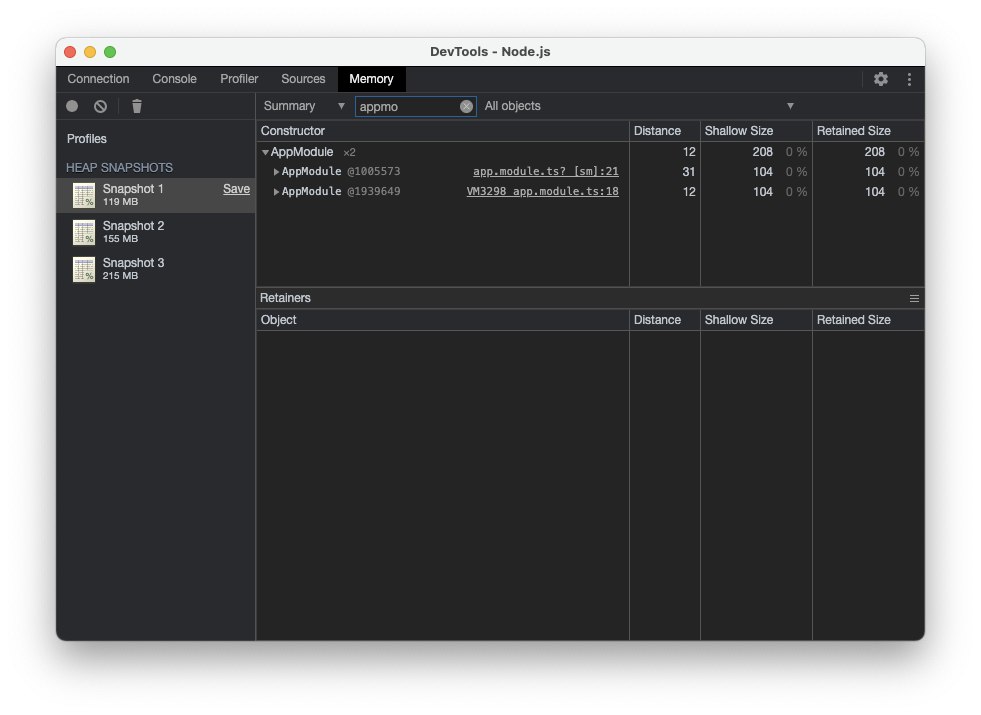
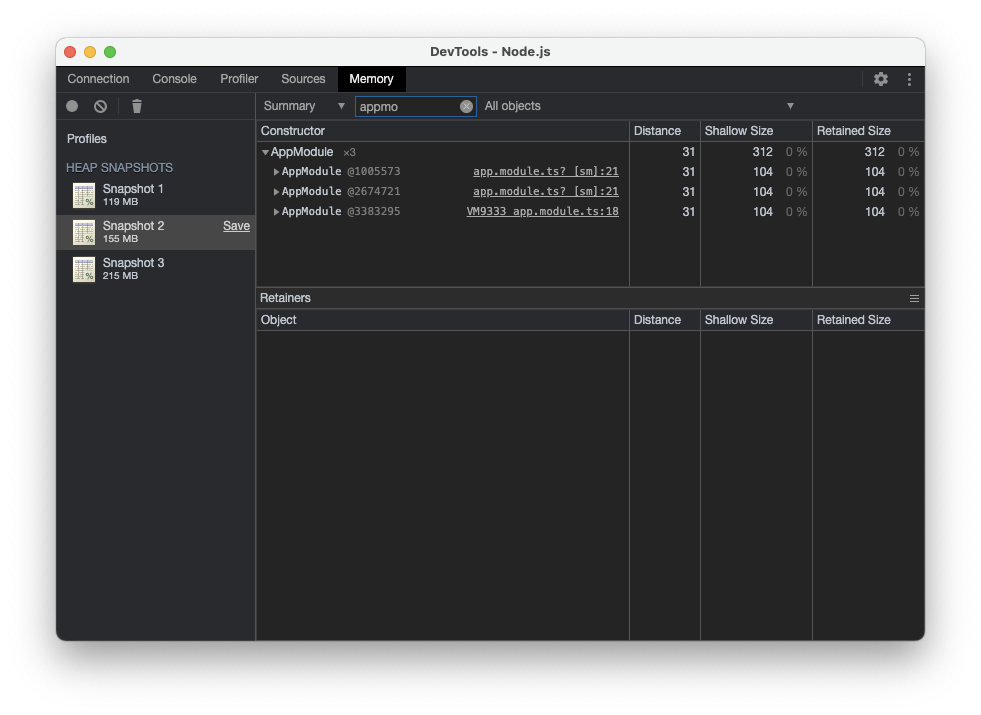
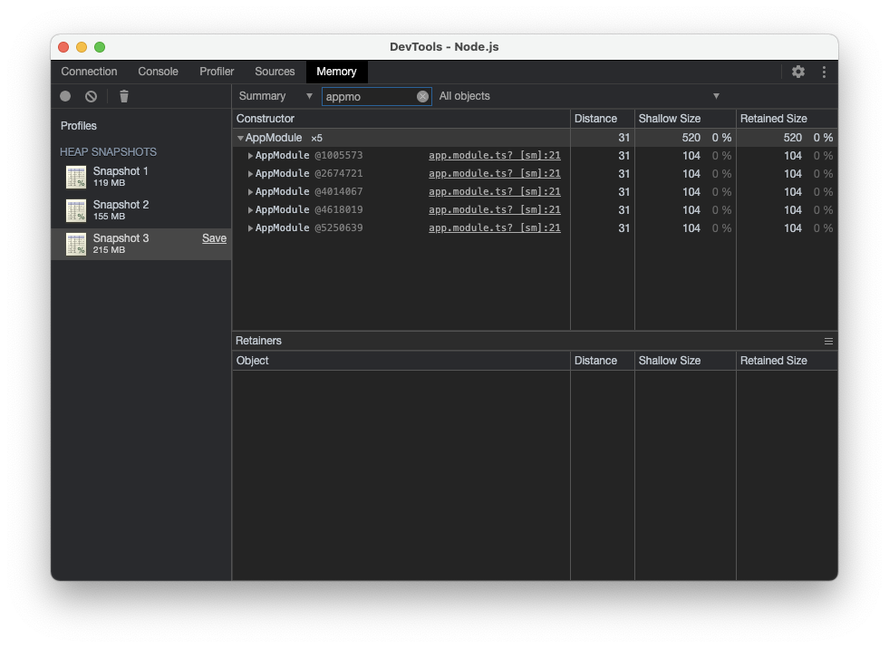

# Nest E2E Memory Leak

Try reproduce memory leak on e2e test.

## Increasing heap usage

```shell
npm run test:heap

> application@0.0.1 test:heap
> node --expose-gc ./node_modules/.bin/jest --config ./test/jest-e2e.json --runInBand --logHeapUsage

 PASS  test/client.e2e-spec.ts (87 MB heap size)
   PASS  test/copies/friend.e2e-spec.ts (107 MB heap size)
   PASS  test/friend.e2e-spec.ts (108 MB heap size)
   PASS  test/copies/customer.e2e-spec.ts (108 MB heap size)
   PASS  test/customer.e2e-spec.ts (108 MB heap size)
   PASS  test/user.e2e-spec.ts (109 MB heap size)
   PASS  test/copies/member.e2e-spec.ts (109 MB heap size)
   PASS  test/member.e2e-spec.ts (109 MB heap size)
   PASS  test/copies/user.e2e-spec.ts (110 MB heap size)
   PASS  test/copies/app.e2e-spec.ts (110 MB heap size)
   PASS  test/copies/client.e2e-spec.ts (110 MB heap size)
   PASS  test/app.e2e-spec.ts (110 MB heap size)

  Test Suites: 12 passed, 12 total
  Tests:       32 passed, 32 total
  Snapshots:   0 total
  Time:        6.236 s, estimated 54 s
  Ran all test suites.
```

## Increasing instances




